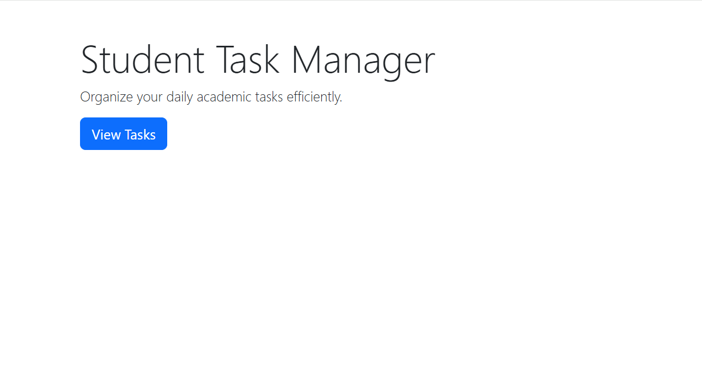
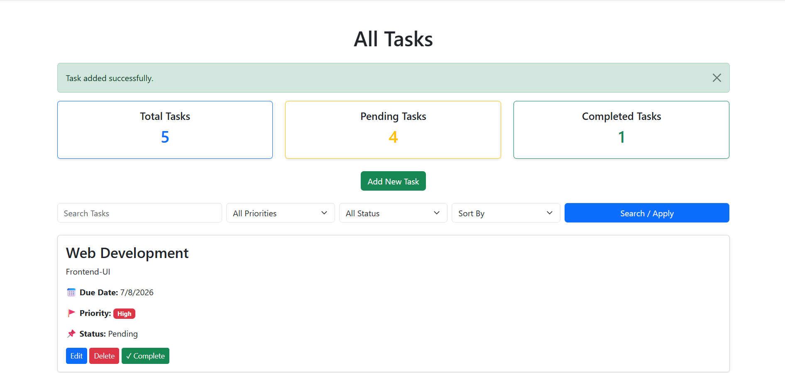
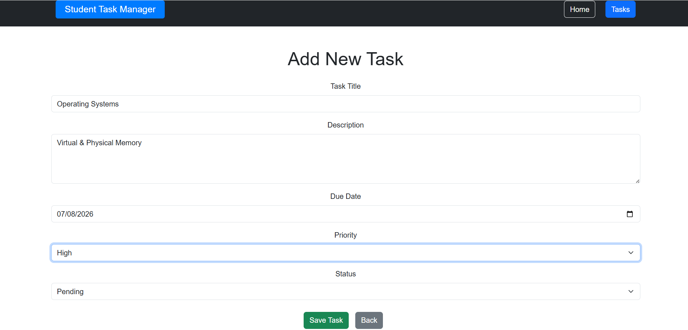
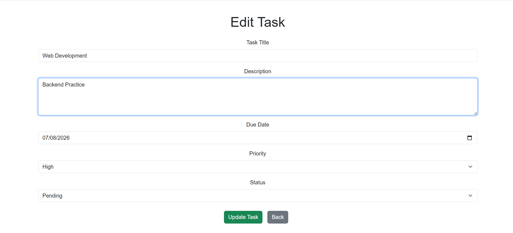
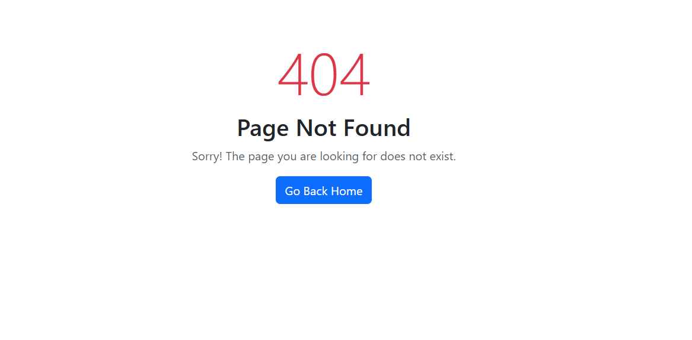

# 📋 Student Task Manager

A Task Management Web Application built with **Node.js, Express.js, MongoDB, Mongoose, EJS, and Bootstrap** following the MVC Architecture.

This project allows users to manage daily tasks with complete CRUD functionality and additional productivity features like search, filtering, sorting, dashboard statistics, and task completion.

---

## 🚀 Features

- Create Tasks
- View All Tasks
- Edit Existing Tasks
- Delete Tasks
- Mark Task as Completed
- Search Tasks
- Filter by Priority
- Filter by Status
- Sort by Title
- Sort by Due Date
- Sort by Priority
- Dashboard Statistics
- Server-side Validation
- Flash Messages
- Custom 404 Page
- Responsive Bootstrap UI
- MongoDB Database Integration

---

## 🛠 Technologies Used

- Node.js
- Express.js
- MongoDB
- Mongoose
- EJS
- Bootstrap 5
- Express Session
- Connect Flash
- Git
- GitHub

---

## 📁 Project Structure

```
Student-Task-Manager/
│
├── controllers/
├── models/
├── public/
│   ├── css/
│   └── js/
├── routes/
├── views/
├── app.js
├── package.json
└── README.md
```

---

## ⚙ Installation

Clone the repository

```bash
git clone https://github.com/raila-shaukat/Student-Task-Manager.git
```

Move into the project folder

```bash
cd Student-Task-Manager
```

Install dependencies

```bash
npm install
```

Start the application

```bash
npm run dev
```

Open in browser

```
http://localhost:3000
```

---

## 📸 Screenshots

Screenshots of the application can be added here.

- Home Page
  
  
- Task Dashboard
- 
  
- Add Task
  
  
- Edit Task
  
  
- 404 Page


---

## 🌟 Future Improvements

- User Authentication
- User Registration
- Password Encryption
- User-specific Tasks
- Dark Mode
- File Upload Support
- MongoDB Atlas Deployment

---

## 👩‍💻 Author

**Raila Shaukat**

GitHub:
https://github.com/raila-shaukat
